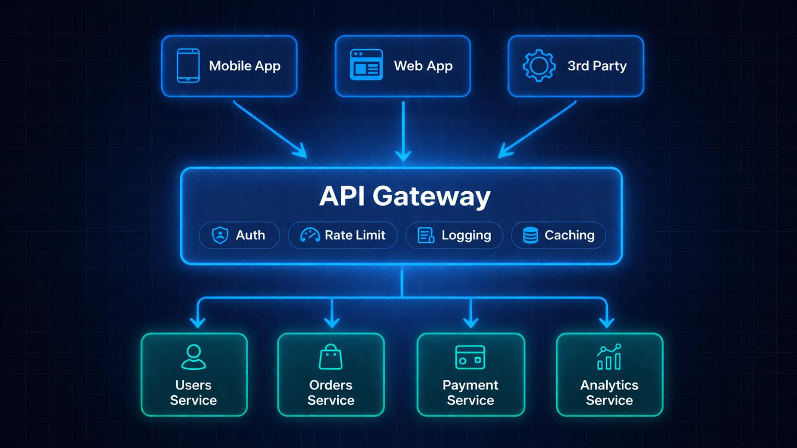
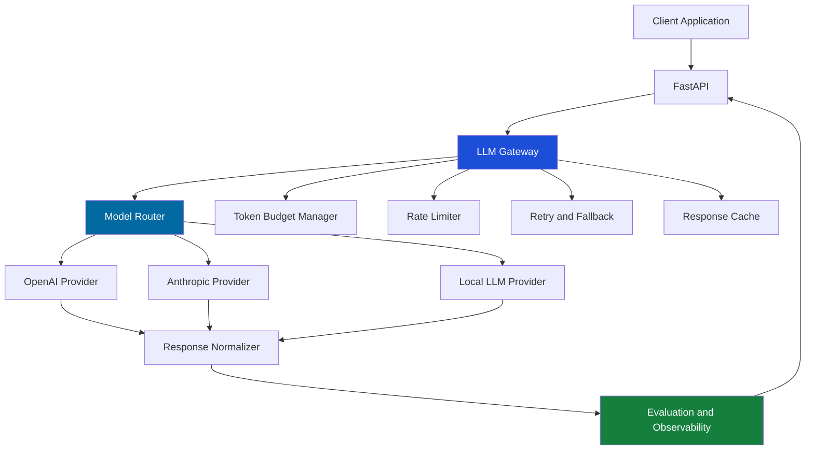

# LLM Gateway

Architecture:

```mermaid
flowchart TB
    A[Client Application] --> B[FastAPI]
    B --> C[LLM Gateway]
    C --> D[Model Router]

    D --> E[OpenAI Provider]
    D --> F[Anthropic Provider]
    D --> G[Local LLM Provider]

    C --> H[Token Budget Manager]
    C --> I[Rate Limiter]
    C --> J[Retry and Fallback]
    C --> K[Response Cache]

    E --> L[Response Normalizer]
    F --> L
    G --> L

    L --> M[Evaluation and Observability]
    M --> B

    style C fill:#1d4ed8,color:#fff
    style D fill:#0369a1,color:#fff
    style M fill:#15803d,color:#fff
```
